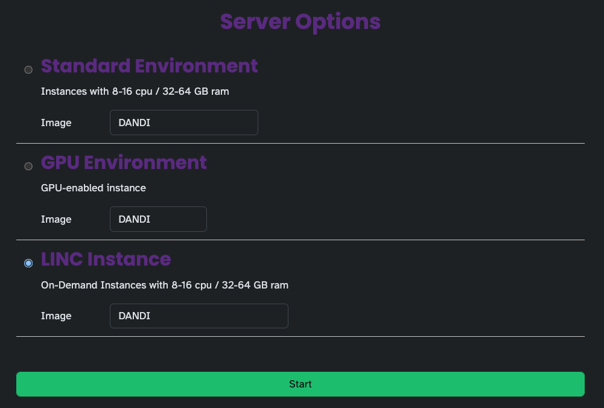

# JupyterHub

All LINC users have access to the [DANDI Hub](https://hub.dandiarchive.org/).

## On-demand instances

Currently on DANDI Hub, all users have access to spot instances, which are cheaper but the sessions could get interrupted. Please let Kabi know if you are running long processing sessions and would like access to the on-demand instances.

Once you have access to the on-demand instances, select `LINC Instance` from the `Server Options`. See image below.

Once you are done with the instance, navigate to https://hub.dandiarchive.org/hub/home and please select `Stop My Server`. There is an automatic timeout but this will help save costs.

