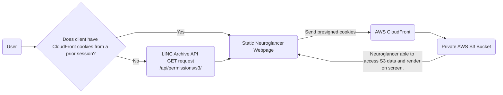

# Visualize private S3 assets with Neuroglancer

Collaborators: Aaron Kanzer, Kabilar Gunalan

Outlined below are 3 use cases for visualizing private assets in Neuroglancer.
In the current effort, requirements and a subsequent implementation will be developed for use cases 1 and 2.

## Use cases

### Use case 1
Use the `External Services` button in the `FileBrowser` to load a Neuroglancer viewer with
a single layer of the corresponding asset.  The resulting URL can be shared between LINC team members.  This use case extends the capabilities in the DANDI Archive to view assets in a private S3 bucket.

### Use case 2
Set a single Neuroglancer viewer programmatically to visualize multiple assets (e.g. dMRI, HiP-CT) as layers.

### Use case 3
Use case 2 + Load the tractography-generated streamlines (i.e. `trk` file) into memory,
convert the streamlines into the Neuroglancer skeleton format, and visualize in the Neuroglancer
viewer as an additional layer.

## Requirements

1. Zarr archives are stored in a private AWS S3 bucket
2. Provide LINC users with direct access to the assets that are stored in the private S3 bucket using a URI.

## Implementation Options

### Issue read-only credentials for S3 bucket. Quick set up.

Does not resolve rendering issue. Would resolve accessing the asset in Jupyter Notebook, but would require flaky Python code.

### Integrate read-only credentials for S3 bucket into LINC Archive, LINC CLI

#### CloudFront distribution with Origin Access Identity control for relevant S3 buckets

- S3 Asset Bucket is served via a CloudFront distribution
- User navigates to LINC Archive (i.e. `lincbrain.org`) to authenticate.  Thereby the user hits a get_presigned_cookie/ API endpoint. In the endpoint response is a valid cookie that allows the user's browser to be able to access the asset via their browser.

Render with hosted Neuroglancer
- Host Neuroglancer fork on S3 bucket with static site hosting enabled. Create an AWS CloudFront distribution to sit as a verified proxy with permission to access many S3 assets at once via presigned cookies.  Provide CNAME for CloudFront Distribution URL to `neuroglancer.lincbrain.org` so that cookies generated by LINC Archive (also living at a `*.lincbrain.org`) can be shared between the API and the Neuroglancer site.
- Modify the Neuroglancer source code to handle a CloudFront asset path (i.e. `neuroglancer.lincbrain.org` since the domains of the presigned cookie are limited to `*.lincbrain.org` domains due to same-site requirements for cookies) that is similar to any S3 asset path (i.e. `s3://`).
- Cookies would get passed in request to get asset
- See the [diagram](#diagram) section for further details on the design.

#### AWS Cognito, npm AWS SDK package

TBD

#### Provide endpoint to provide pre-signed S3 Asset URLs

Blocker: Pre-signed URLs can only be generated at the object-level, not at the sub-directory level. Neuroglancer renders many
objects at once as a user zooms, scrolls, etc., thus unless we generated a pre-signed URL for each asset, this would be difficult.

#### Netlify OAuth requirement to render site

Would pass credentials to AWS.  Solves rendering issue, but does not solve accessing private S3 assets.

#### Diagram

