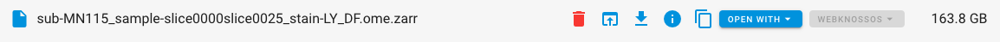
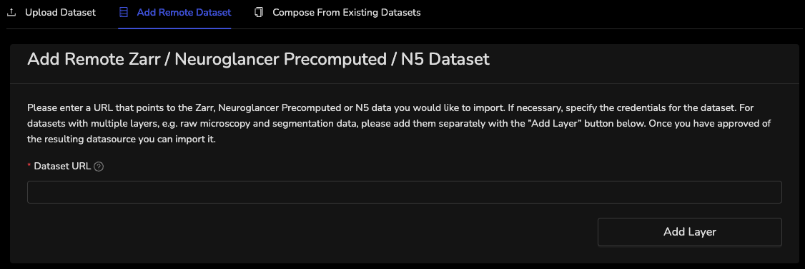
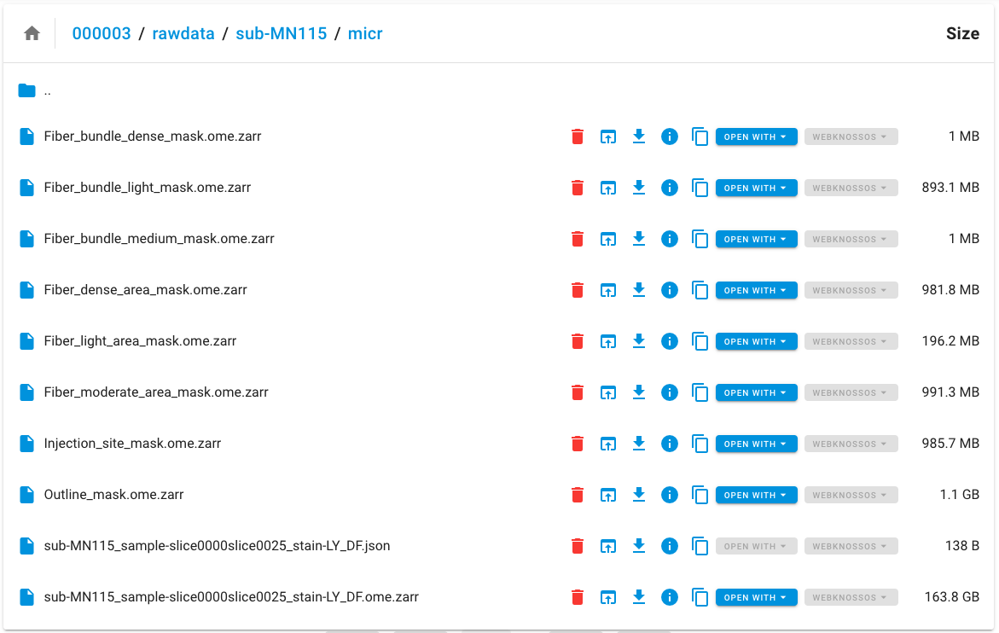

# Add Webknossos Dataset

The following steps provide instructions for adding assets from the LINC Data Platform to LINC Webknossos.  This process has not been automated as it is often the case that multiple assets are added as layers to a single Webknossos dataset, and a pattern for adding these layers has not yet been established.

1. Navigate to an asset on the [LINC Data Platform](https://lincbrain.org/), and find the “Copy” button:

    

2. Select the AWS S3 URI “Copy” button:

    

3. The AWS S3 URI is now copied to your clipboard.

4. Proceed to [LINC Webknossos](https://webknossos.lincbrain.org).

5. Under the “Datasets” tab, select “+ Add Dataset”:

    

6. Navigate to the “Add Remote Dataset” tab:

    

7. Paste the AWS S3 URI in the “Dataset URL” field and select “Add Layer”.

8. Add the dataset name that follows the convention below:

    

    - For a Webknossos dataset with a single layer, the name should match the file naming convention on the LINC Data Platform and add a prefix with the dataset identifier (i.e. `<dataset-id>_<filename>.ome.zarr`).  For example, the last Zarr asset in the figure below would be named as follows: `000003_sub-MN115_sample-slice0000slice0025_stain-LY_DF.ome.zarr`

        

    - For a Webknossos dataset with multiple layers that are comprised of the histology image and Vaanathi Sundaresan's previously generated annotations, the name will follow the convention for [Webknossos annotations](https://docs.lincbrain.org/upload/#high-res-histology-annotation) and include Vaanathi Sundaresan's initials.
