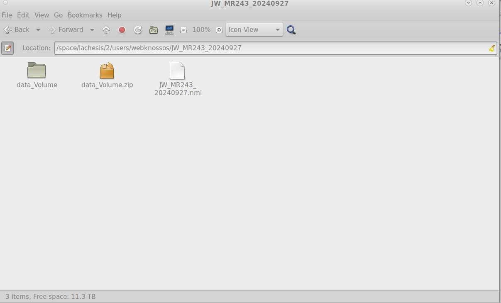

# Export Annotations from Webknossos

The following steps provide instructions for downloading annotations from webknossos. 

1. Go to the `Annotations` tab and click `Open` for a desired annotation.

    

2. Click `Download` in the dropdown `Menu`.

    

3. Select `Include volume annotations as WKW` and click on `Download`.

    

4. Unzip the downloaded annotation file.

5. Unzip data_Volume.zip under annotation folder 

    

6. Run the [webknossos_annotation.py](https://github.com/lincbrain/linc-convert/blob/main/linc_convert/modalities/wk/webknossos_annotation.py) script to save into the OME-Zarr format following the `czyx` direction. 

   
