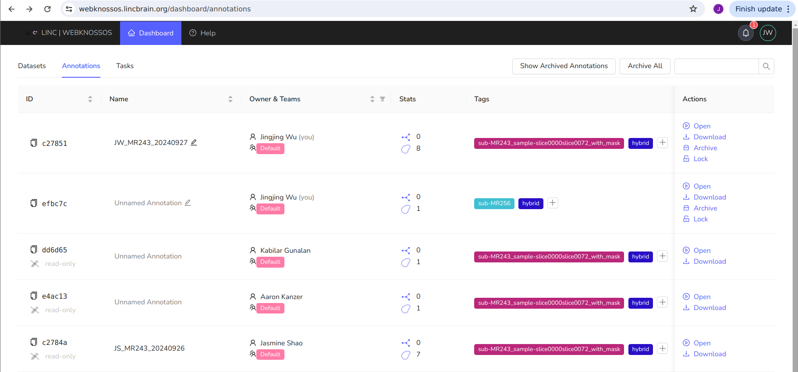

# Export Annotations from Webknossos

The following steps provide instructions for downloading annotations from webknossos. 

1. Go to Annotations tab and click open on target annotation

    

2. Click on Download on dropdown menu

    

3. Select "Include volume annotations as WKW" on pop out box and click on Download

    

4. Unzip downloaded annotation file 

5. Unzip data_Volume.zip under annotation folder 

    

6. Run Script webknossos_annotation.py to save into ome.zarr format following czyx direction. 

   
